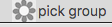
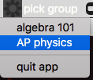
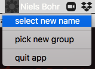

# Flower Picker
## A tranquil tool to select a name from a list

This node script adds a clickable tool to your menu bar that allows you to randomly select a value from a list.

Recommended for a teacher or facilitator in an online setting to be able to randomly call on someone. Perfect for remote educators. Uses electron.js . Tested only on OSX (so far).

## Features
- Allows tracking of multiple groups of people. Such as:
  - online classes
  - meeting groups
- Keeps track of whether or not a name was recently selected, and orders those names at the end of the list when creating an initial order.
- Persists data in a file
- Simple yaml format for creating lists of names

## Requirements
- node
- npm
- OSX (electron.js is designed to be cross-platform. This may work on windows/linux, but I have not yet tested, or received reports).
## Installation
- Clone this repository to your local machine
- `cd` into the `flower-picker` directory
- run `npm install`
## Usage
- `cd` into the `flower-picker` repository
- run `npm start` .
- The first time you run the app, you should hold down ⌘ and click/drag the flower icon to the right side of your menubar. This will ensure the names are visible when using an app with many menu items that might cover over some of the menubar icons.
- The next time you start, this position should be remembered by the OS.
- The rest is fairly self-explanitory
## Caveat
- If you want your participants to see the picker app in their menu bar and are using Zoom for screen sharing, you will need to share a "Desktop". Otherwise, when sharing just the current app window, the menu bar won't be visible to others. 

## FAQ
Q: When do the names shuffle, and how are they ordered?

A: A shuffled order is created after you select a group. Names that have not been recently called will be ordered at the beginning. That same shuffled order will persist until you use "select group" again, or the next time you start the app and select the same group.

Q: Where do I edit my group lists?

A: in `db/cohorts.yaml` . The first time you start the app, if you haven't added a group list, one will be automatically generated from `db/cohorts.sample.yaml` and saved as `db/cohorts.yaml`. This file is in `.gitignore` for privacy.

### Protips!

- Clone this repo into dropbox (or symlink `db/cohorts.yaml` into dropbox) and you will be able to sync your pick status across different computers
- Make an alias for easy launching! Here's mine: `alias picker="npm run --prefix ~/Dropbox/code/flower-picker/ start"` 

